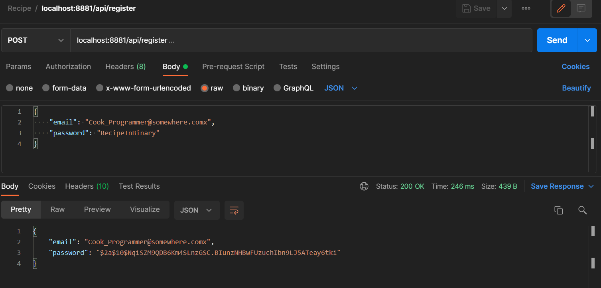
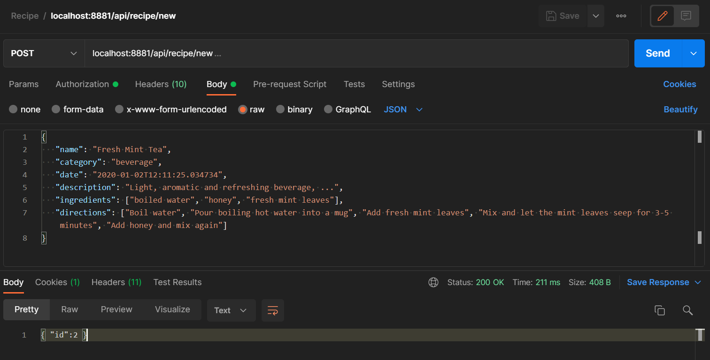
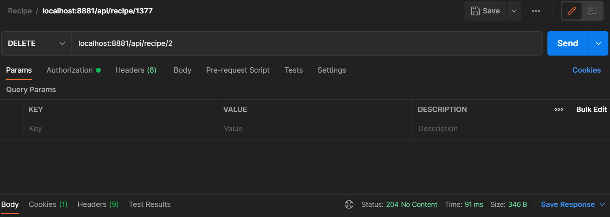

# Recipes Rest App
Restful Api Recipe - JetBrains Academy Project.

## About
Application that stores all recipes in one place. Multi-user web service with Spring Boot that allows storing, retrieving, updating, and deleting recipes.

## Tech
- Java
- Spring Framework
- Spring Security
- Hibernate
- H2 Database
- Json
- Lombok

## Illustrations

### Register user

### Create new recipe

### Get recipy by Id

### Delete recipe

