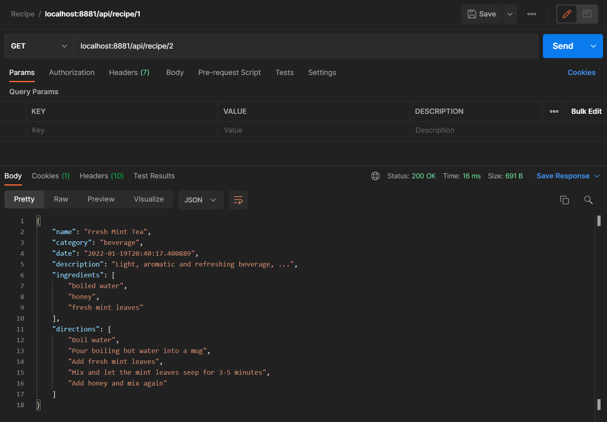

# Recipes Rest App
Restful Api Recipe - JetBrains Academy Project.

## About
Application that uses the basics of user authentication and authorization, know how to register security events, and get acquainted with various requirements, such as modern information security standards for web applications. Logging in console and persistance events in database.

## Tech
- Java
- Spring Framework
- Spring Security
- Hibernate
- H2 Database
- Json
- Lombok

## Illustrations

### Register user

### Create new recipe

### Get recipy by Id

### Delete recipe

